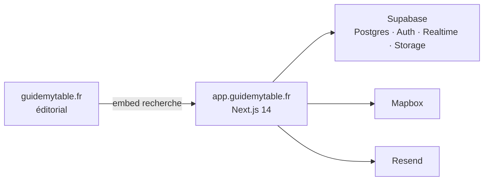

<div align="center">


<br/>

<a href="https://guidemytable.fr"></a>
&nbsp;
<a href="https://app.guidemytable.fr"></a>
&nbsp;
<a href="https://app.guidemytable.fr/explore"></a>

<br/><br/>


<p>
  <sub>
    <a href="https://guidemytable.fr">guidemytable.fr</a>
    &nbsp;·&nbsp;
    <a href="https://app.guidemytable.fr">app.guidemytable.fr</a>
    &nbsp;·&nbsp;
    <a href="mailto:contact@guidemytable.fr">contact@guidemytable.fr</a>
  </sub>
</p>

</div>

---

**Guide My Table** est live.

C’est la plateforme qui met une table privée chez vous : des chefs sélectionnés, une carte pour les trouver, une réservation pour les engager, un chat pour tout caler. Le site éditorial vit sur [`guidemytable.fr`](https://guidemytable.fr). Le produit — explorer, booker, parler — tourne ici, sur [`app.guidemytable.fr`](https://app.guidemytable.fr).

Ce dépôt n’est plus un chantier « coming soon ». C’est le code de production.


## Surface

| | Produit | Où |
| :--- | :--- | :--- |
| **01** | Carte des chefs, fiches, galerie, recherche embarquée WordPress | [`/explore`](https://app.guidemytable.fr/explore) |
| **02** | Réservation dîner / cours / événement, validation, emails | `/book/[slug]` |
| **03** | Conversation client ↔ chef en temps réel | `/chat` |
| **04** | Admin, visibilité, comptes, relances | `/admin` |

Auth email + mot de passe. Comptes créés confirmés. Rôles client, chef, admin. FR et EN partout.

## Architecture



- **App** — Next.js 14 App Router, TypeScript, Tailwind, Motion
- **Data** — Supabase Postgres, RLS, Realtime pour le chat
- **Map** — Mapbox GL, autocomplete d’adresse
- **Mail** — Resend, templates transactionnels
- **I18n** — `next-intl`, `messages/fr.json` + `en.json`

## Local

Le mode d’emploi agent / Cloud est dans [`AGENTS.md`](./AGENTS.md) — stack Supabase locale, CSP `*.supabase.co`, bootstrap SQL, caveats email & Mapbox. Ne pas dupliquer ici.

```bash
npm install
cp .env.example .env.local   # puis coller les clés
npm run dev                  # http://localhost:3000
```

```bash
npm run lint
npm run test:unit
npm run build
```

## Repo

Projet privé. Pas de contributions publiques.

© Guide My Table — tous droits réservés.
